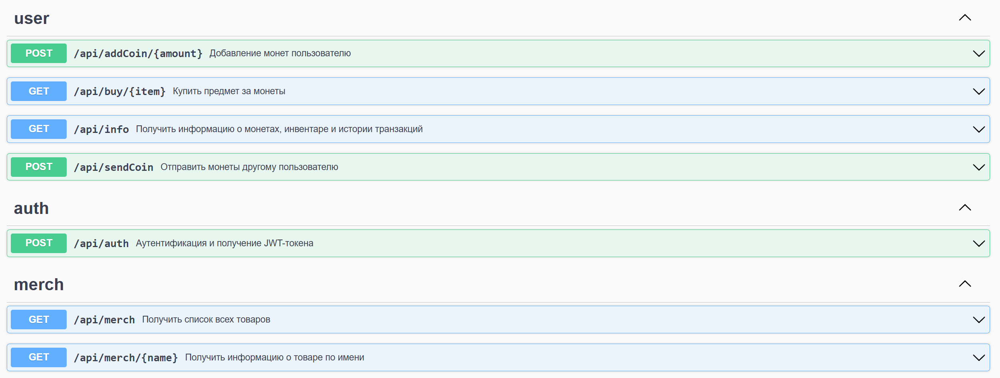
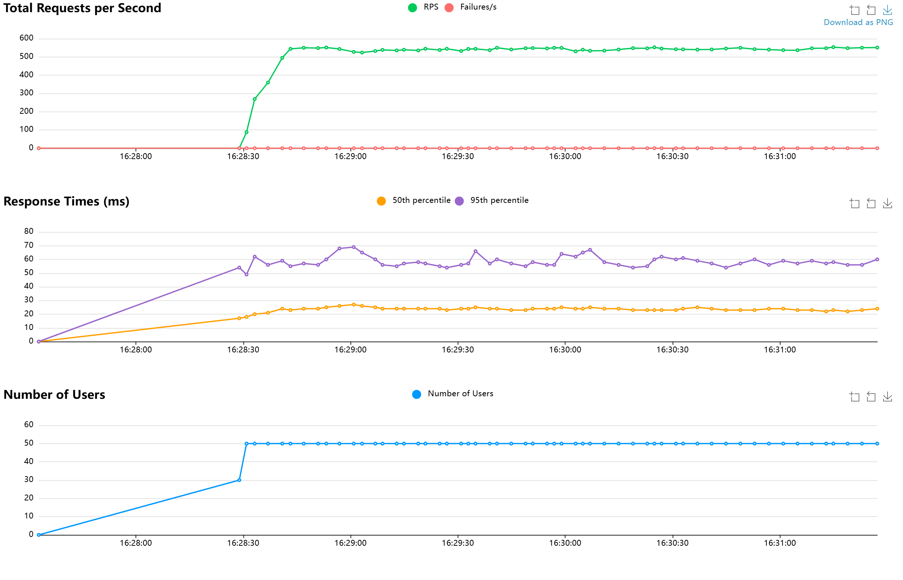

# Avito-backend-trainee-assignment-winter-2025

Реализация API для магазина мерча в рамках тестового задания для стажера Backend-направления avito.

## Основные возможности:
- Автоматическая регистрация и вход через JWT.
- Магазин товаров: Доступно 10 типов мерча с фиксированными ценами, которые можно приобрести за монеты.
- Перевод монет: Пользователи могут передавать монеты другим сотрудникам.
- История транзакций: Пользователи могут просматривать все свои транзакции, включая переданные и полученные монеты.
- Поддержка высокой нагрузки (1k запросов в секунду при времени ответа < 50ms).
- API с документацией с помощью Swagger


## Стек технологий
- Веб-фреймворк: **Fiber**
- Аутентификация: **JWT**
- База данных: **PostgreSQL**
- ORM: **GORM**
- Миграции базы данных: **Gormigrate**
- Логирование: **Zerolog**
- Конфигурация: **Viper**
- Документирование API: **Swagger**
- Тестирование: **Testify**
- Тестирование производительности: **Locust**
- Линтер: **golangci-lint**
- Деплой: **Docker**


## Установка и запуск

1. Клонировать репозиторий:
```bash
git clone https://github.com/mihailpestrikov/Avito-backend-trainee-assignment-winter-2025
cd Avito-Backend-Trainee-Assignment-Winter-2025
```
2. Запустить сервисы:

```bash
docker-compose up
```  

3. Сервис доступен по адресу:
```
API: http://localhost:8080
Swagger: http://localhost:8080/index.html
```

## API


### 1. Аутентификация
**POST /api/auth**
- Регистрация или вход с именем пользователя и паролем
- ### request:
```json
{
  "username": "testuser",
  "password": "testpassword"
}
```
- ### response:
```json
{
  "token": "jwt_token_here"
}
```

### 2. Получение информации (protected)
**GET /api/info**
- Получение баланса, истории транзакций и списка приобретенных товаров
```
Authorization: Bearer <token>
```
- ### response:
```json
{
    "coins": 2870,
    "inventory": [
        {
            "type": "t-shirt",
            "quantity": 5
        }
    ],
    "coinHistory": {
        "received": null,
        "sent": [
            {
                "toUser": "testuser",
                "amount": 50
            }
        ]
    }
}
```
### 3. Перевод монет (protected)
**POST /api/sendCoin**
- Передача монет другому сотруднику
```
Authorization: Bearer <token>
```
- ### request:
```json
{
  "toUser": "anotherUser",
  "amount": 100
}
```
### 4. Покупка товара (protected)
**GET /api/buy/{item}**
```
Authorization: Bearer <token>
```

**Мерч** — это продукт, который можно купить за монетки. Всего в магазине доступно 10 видов мерча. Каждый товар имеет уникальное название и цену.

| Название     | Цена |
|--------------|------|
| t-shirt      | 80   |
| cup          | 20   |
| book         | 50   |
| pen          | 10   |
| powerbank    | 200  |
| hoody        | 300  |
| umbrella     | 200  |
| socks        | 10   |
| wallet       | 50   |
| pink-hoody   | 500  |

## Конфигурация
Конфигурация приложения хранится в config/config.yaml, config/config.local.yaml (dev, prod) и загружается с помощью библиотеки Viper.
Пример конфигурации:
- Общий конфиг
```yaml
app:
  name: "avito-shop-service"
  host: "0.0.0.0"
  port: "8080"
  shutdown-timeout: 30s
```
- Локальный конфиг
```yaml
db:
  host: "postgres"
  user: "avito"
  password: "secret"
  name: "avito_shop"
  port: "5432"
  ssl-mode: "disable"
  max-open-conns: 50
  max-idle-conns: 10
  conn-max-lifetime: 60s
log:
  level: "info"
  format: "text"
auth:
  secret-key: "my-test-secret-key"
```

## Нагрузочное тестирование
ограничение в "сервере"
- rps ~500
- response time ~ 40ms
- failures 0%




```python
from locust import HttpUser, task, between

class MyUser(HttpUser):
    wait_time = between(0.05, 0.2)

    @task
    def auth_and_get_info(self):
        auth_response = self.client.post(
            "/api/auth", json={"username": "testuser", "password": "password"})

        if auth_response.status_code == 200:
            token = auth_response.json().get("token")

            headers = {"Authorization": f"Bearer {token}"}
            self.client.get("/api/info", headers=headers)

if __name__ == "__main__":
    import os
    os.system("locust -f locustfile.py --run-time 3m --host http://localhost:8080 "
              "--web-host=127.0.0.1 --web-port=8089")
```

## Тесты
e2e тесты
```
go test ./tests/e2e
```
unit тесты
```
go test ./tests/unit
```
Проблема: не хотел использовать реальную бд, не хотел поднимать вторую тестовую бд, были проблемы с использованием моковой in-memory sqlite, поэтому долго не мог прийти к написанию e2e теста.  
Решение: остановился на том, что текущий конфиг и docker-compose являются local, то есть тестовыми, поэтому использую postgres для e2e тестов, для prod была бы отдельная бд  
Также стоило попробовать использовать Mockery для более удобных, лаконичных, читаемых тестов
